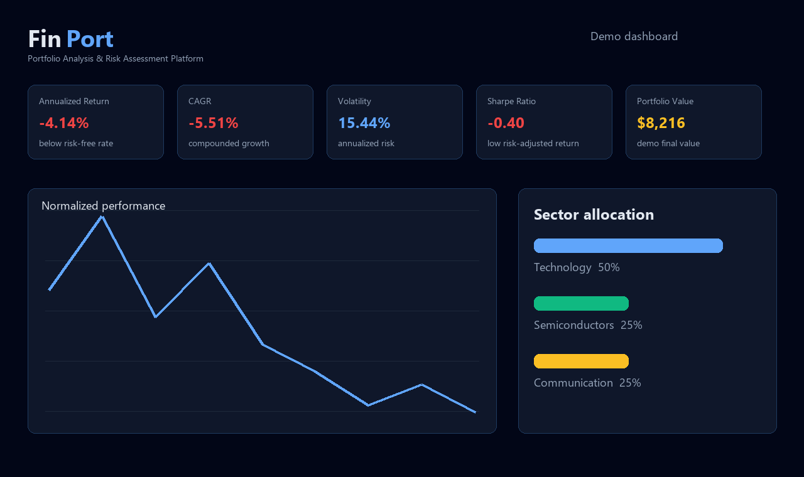
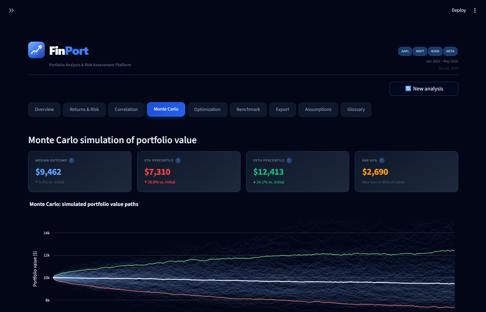
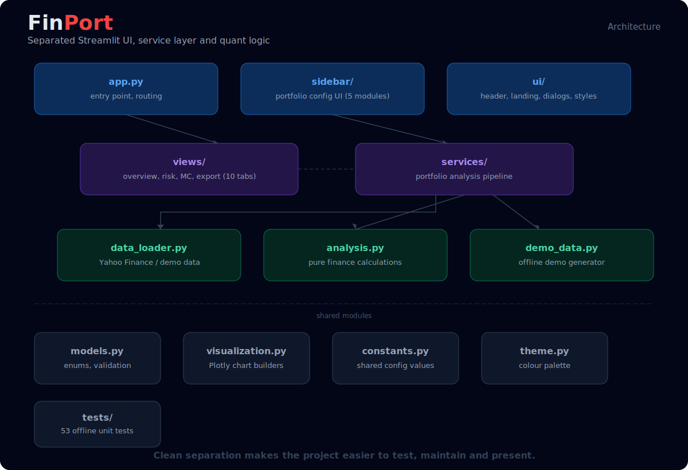

# FinPort

[](https://github.com/ununtridev/finport/actions/workflows/tests.yml)

FinPort is a Streamlit fintech dashboard for portfolio analysis and risk
assessment. It was built as a university Finance and Banking project, with a
focus on realistic quantitative finance logic, clean UI, modular Python code,
and reproducible local execution.

The application lets users build a multi-asset portfolio, download historical
market data, calculate risk and return metrics, compare portfolio strategies,
run Monte Carlo simulations, generate optimization results, and export reports.

## Preview

### Dashboard overview



### Monte Carlo risk simulation



### Project architecture



## Key Features

- Multi-asset portfolio configuration with ticker chips
- Automatic weight rebalancing to 100%
- Lockable portfolio weights
- Quick-add lists for stocks, indexes and crypto tickers
- Demo/offline mode for presentations without live market-data requests
- Historical adjusted close prices from Yahoo Finance via `yfinance`
- Daily returns and descriptive statistics
- Annualized return, volatility, CAGR, Sharpe ratio and Sortino ratio
- Maximum drawdown analysis
- Correlation matrix and diversification analysis
- Sector allocation breakdown
- Equal-weight benchmark comparison
- CAPM analysis versus S&P 500:
  - Beta
  - Alpha
  - R-squared
  - Correlation
- Markowitz portfolio optimization:
  - Efficient frontier
  - Maximum Sharpe portfolio
  - Minimum variance portfolio
- Monte Carlo simulation:
  - Parametric normal simulation
  - Historical bootstrap simulation
  - Value at Risk style downside estimate
- Export options:
  - PDF report
  - Excel workbook
  - CSV price, returns and summary data
- Save/load portfolio configuration as JSON
- Finance glossary and model assumptions tab
- Offline unit/integration tests for core logic

## Tech Stack

- Python
- Streamlit
- pandas
- numpy
- scipy
- plotly
- yfinance
- fpdf2
- openpyxl
- pytest
- Ruff

## Project Structure

```text
.
├── app.py                         # Streamlit UI entry point
├── analysis.py                    # Pure quantitative finance calculations
├── constants.py                   # Shared configuration constants
├── data_loader.py                 # Yahoo Finance price and metadata loading
├── demo_data.py                   # Offline deterministic demo data generator
├── models.py                      # Dataclasses, enums and validation
├── portfolio_config.py            # Save/load portfolio config parsing
├── portfolio_state.py             # Testable portfolio weight state logic
├── report_exporter.py             # PDF, Excel and CSV export helpers
├── ticker_utils.py                # Ticker normalization and validation
├── theme.py                       # Shared chart/UI palette
├── ui_components.py               # Reusable Streamlit HTML components
├── visualization.py               # Plotly chart builders
├── content/
│   └── glossary.py                # Finance glossary content
├── sidebar/
│   ├── __init__.py                # Public API: render_sidebar, SidebarState
│   ├── callbacks.py               # Sidebar event callbacks
│   ├── donut.py                   # Allocation donut chart
│   ├── sections.py                # Sidebar section renderers
│   └── state.py                   # SidebarState dataclass
├── services/
│   └── portfolio_analysis.py      # End-to-end analysis orchestration
├── ui/
│   ├── dialogs.py                 # Streamlit dialogs
│   ├── header.py                  # Dashboard header banner
│   ├── landing.py                 # Landing page before analysis
│   ├── loader.py                  # Money-themed loading overlay
│   ├── logo.py                    # Inline SVG FinPort logo
│   └── styles.py                  # Shared Streamlit CSS
├── views/
│   ├── dashboard_tabs.py          # Tab router
│   ├── overview.py                # Overview tab
│   ├── monte_carlo.py             # Monte Carlo tab
│   ├── optimization.py            # Efficient frontier / optimization tab
│   ├── benchmark.py               # Benchmark comparison tab
│   ├── export.py                  # Report/data export tab
│   └── ...                        # Remaining dashboard tabs
├── docs/
│   └── screenshots/               # README preview images
├── examples/
│   └── sample_portfolio.json      # Example saved portfolio configuration
├── tests/
│   ├── test_analysis.py
│   ├── test_data_loader.py
│   ├── test_demo_data.py
│   ├── test_models.py
│   ├── test_portfolio_analysis_service.py
│   ├── test_portfolio_config.py
│   ├── test_portfolio_state.py
│   ├── test_portfolio_state_properties.py  # Hypothesis property tests
│   └── test_report_exporter.py
├── .github/
│   └── workflows/                 # GitHub Actions CI
├── .streamlit/
│   └── config.toml                # Streamlit theme/config
├── Dockerfile                     # Container build for deployment
├── pyproject.toml                 # pytest and Ruff configuration
├── requirements.txt               # Runtime dependencies
├── requirements-dev.txt           # Developer/test dependencies
└── runtime.txt                    # Python runtime for deployment
```

## Architecture

FinPort separates the application into four main layers:

1. **UI layer**: `app.py`, `sidebar/`, `ui/`, `ui_components.py`
2. **Application service layer**: `services/portfolio_analysis.py`
3. **Finance calculation layer**: `analysis.py`
4. **Data/export layer**: `data_loader.py`, `report_exporter.py`

The Streamlit app is responsible for user interaction and rendering. The
portfolio analysis service coordinates the full analysis pipeline and returns a
structured `PortfolioAnalysisResult`. Core financial calculations are pure
functions, which makes them easier to test and maintain.

## Installation

Clone the repository and enter the project folder:

```powershell
git clone https://github.com/ununtridev/finport.git
cd finport
```

Create a virtual environment:

```powershell
python -m venv .venv
```

Activate it on Windows PowerShell:

```powershell
.\.venv\Scripts\Activate.ps1
```

Install runtime dependencies:

```powershell
pip install -r requirements.txt
```

For development and tests, install developer dependencies too:

```powershell
pip install -r requirements-dev.txt
```

## Running The App

Start the Streamlit dashboard:

```powershell
streamlit run app.py
```

The app will open at:

```text
http://localhost:8501
```

In PyCharm, use the terminal inside the project folder and run the same command.

To open a self-contained demo without Yahoo Finance requests:

```powershell
streamlit run app.py
```

Then open:

```text
http://localhost:8501/?demo=1&autorun=1
```

## Running Tests

Run the full test suite:

```powershell
pytest
```

Run Ruff code checks:

```powershell
ruff check .
```

Run static type checks after installing developer dependencies:

```powershell
mypy .
```

The test suite includes offline tests for the analysis service, so core
portfolio logic can be verified without relying on live Yahoo Finance requests.

## Example Portfolio

An example portfolio configuration is available in:

```text
examples/sample_portfolio.json
```

Use the **Save / Load Configuration** section in the sidebar to load it.

## Financial Methodology

FinPort uses standard quantitative finance methods:

- Daily simple returns: `price_t / price_t-1 - 1`
- Annualized return: average daily return multiplied by 252 trading days
- Annualized volatility: daily standard deviation multiplied by `sqrt(252)`
- Portfolio return: weighted sum of asset returns
- Portfolio volatility: covariance matrix calculation
- Sharpe ratio: excess return per unit of total volatility
- Sortino ratio: excess return per unit of downside volatility
- Maximum drawdown: largest peak-to-trough portfolio loss
- CAPM beta/alpha: portfolio sensitivity and excess return versus S&P 500
- Efficient frontier: Markowitz long-only optimization
- Monte Carlo simulation:
  - Parametric normal model using historical mean/covariance
  - Historical bootstrap using sampled historical return rows

## Important Assumptions

- The app uses adjusted close prices from Yahoo Finance.
- Portfolio value is calculated as buy-and-hold from the selected start date.
- Transaction costs, taxes and slippage are not included.
- Metrics are annualized using 252 trading days.
- Monte Carlo scenarios are based on historical data and are not predictions.
- Optimization is long-only and assumes weights sum to 100%.
- Results depend strongly on the selected historical period.

## Deployment

The recommended deployment target is Streamlit Community Cloud.

1. Push the project to GitHub.
2. Go to [Streamlit Community Cloud](https://streamlit.io/cloud).
3. Create a new app from the repository.
4. Set the main file path to:

```text
app.py
```

The repository includes `runtime.txt`, `requirements.txt`, and `.streamlit/config.toml`
for deployment.

## Data Source

Market prices and instrument metadata are downloaded from Yahoo Finance using
`yfinance`.

Known limitations:

- Yahoo Finance can temporarily throttle requests.
- Some tickers may not return sector metadata.
- Recently listed assets may have insufficient historical data.
- Wrong or delisted symbols are excluded from the analysis.
- Live data availability can differ by asset class and region.

## Academic Context

FinPort demonstrates:

- Portfolio construction and weight management
- Historical return and risk analysis
- Diversification and correlation analysis
- Market benchmark comparison
- CAPM interpretation
- Markowitz portfolio optimization
- Monte Carlo risk simulation
- Report generation and data export
- Modular Python application design
- Automated testing of financial logic

## Disclaimer

This application is for educational and academic purposes only. It does not
constitute investment advice, financial recommendation, or an offer to buy or
sell securities. Past performance is not indicative of future results. Market
data is provided by Yahoo Finance and may contain inaccuracies, delays or gaps.

## License

This project is licensed under the MIT License. See [LICENSE](LICENSE) for
details.
